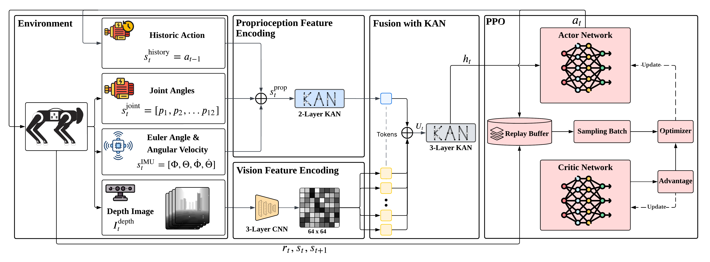

# QuadKan

The source codes of "*QuadKAN: KAN-Enhanced Quadruped Motion Control via End-to-End Reinforcement Learning*".

The code and data processing scripts of this work are coming soon after this work is published.

## Supplements

- Video showing our QuadKAN model performance in trained scenario and two unseen challenging scenarios.

  **Click to view the video:**

  

## Architecture

